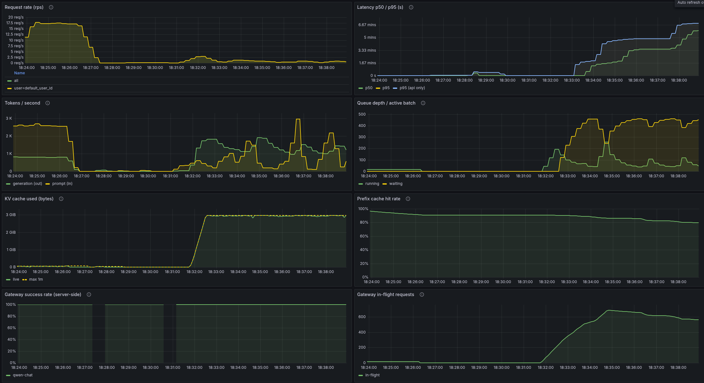
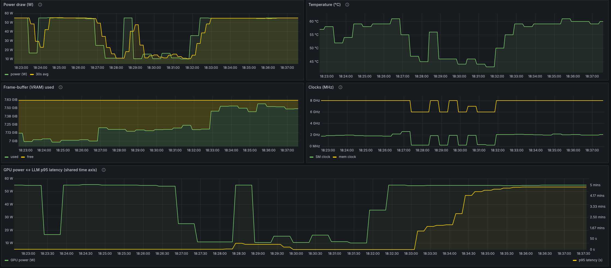
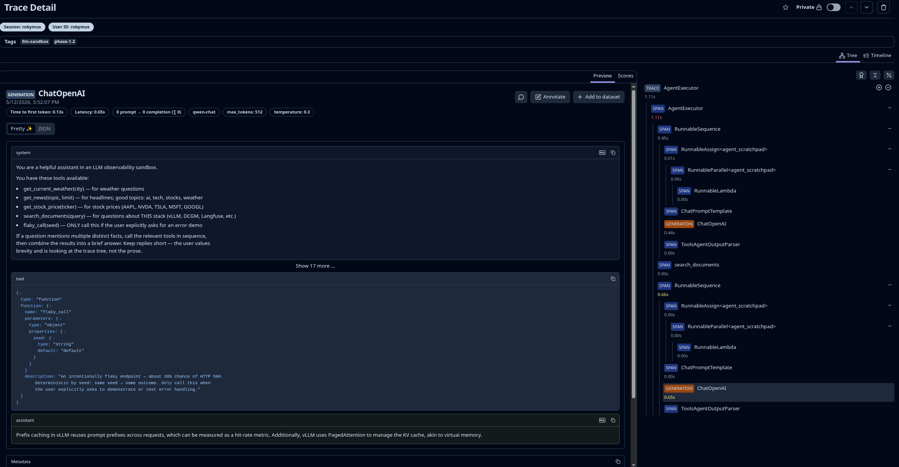

# LLM SRE Sandbox

A local, professional-grade "mini-DC" for serving an LLM, with the full
observability plane wired up around it. Built for **learning** — every layer
exists to teach one thing, and every config decision has a comment or a
README explaining why.

> Status: **Phases 1.0 → 1.3 implemented** — eleven services healthy under
> `docker compose up -d`: vLLM (Qwen2.5-3B-AWQ) + LiteLLM gateway + Langfuse
> traces + Prometheus/Grafana + DCGM/node/cAdvisor exporters + Streamlit
> agent app + mock-services tool backend. Phase 1.4 (CI + polish) is next.
> See [.plans/llm-sandbox-PLAN.md](.plans/llm-sandbox-PLAN.md) for the full
> plan and [.plans/llm-sandbox-TODO.md](.plans/llm-sandbox-TODO.md) for
> current progress.

## What it looks like

The **LLM Overview** dashboard during a saturation event (`./scripts/load.sh marathon --rate=50/s --variations=100`). Request completion rate collapses, queue and in-flight climb, KV cache pegs at slab capacity, prefix-cache hit rate drops as the salted prompts defeat the cache:



The **GPU Saturation** dashboard for the same window. The bottom panel — *GPU power ↔ LLM p95 latency on a shared time axis* — is the headline lesson: power sits at TGP while p95 latency climbs into the minutes:



A **Langfuse trace** for a multi-tool chat turn from the Streamlit app — chain → llm (generation) → tool calls → llm → final reply, with the full span tree on the right:



## Quick links

- [Architecture map](ARCHITECTURE.md) — what's running, how it fits, where to read first
- [Plan](.plans/llm-sandbox-PLAN.md) — full design doc with trade-offs
- [TODO](.plans/llm-sandbox-TODO.md) — phased task list

## Prerequisites

Run the preflight check first:

```bash
./scripts/preflight.sh
```

It verifies:
- Docker Engine + Compose plugin
- NVIDIA driver (`nvidia-smi`)
- NVIDIA Container Toolkit installed AND registered with the Docker daemon
- ≥ 30 GB free on the Docker data dir
- `.env` exists and (optionally) Langfuse keys are present

Any failure prints the exact fix.

## Quickstart (Phase 1.0)

```bash
# 1. Verify the host is ready
./scripts/preflight.sh

# 2. Seed your env. (.env is already created with sane defaults if you
#    followed Phase 1.0; otherwise:)
cp .env.example .env
# then set HF_TOKEN if you want to use gated models later

# 3. Bring up the stack. First start downloads ~2 GB of model weights and
#    takes 60-90 s for vLLM to be ready.
docker compose up -d

# 4. Watch the readiness
docker compose ps
docker compose logs -f vllm-engine
```

### Smoke tests

```bash
# vLLM is up and the model is loaded
curl -s http://localhost:8000/v1/models | jq

# Direct vLLM completion
curl -s http://localhost:8000/v1/chat/completions \
  -H 'Content-Type: application/json' \
  -d '{"model":"qwen-chat","messages":[{"role":"user","content":"say hi"}]}' | jq

# Through the gateway (preferred path — what the agent will use)
curl -s http://localhost:4000/v1/chat/completions \
  -H "Authorization: Bearer $(grep ^LITELLM_MASTER_KEY .env | cut -d= -f2)" \
  -H 'Content-Type: application/json' \
  -d '{"model":"qwen-chat","messages":[{"role":"user","content":"say hi"}]}' | jq

# Langfuse UI — sign up, create a project, then come back here for Phase 1.2 setup
open http://localhost:3001
```

### Where each piece lives

| URL | Service | Useful for |
| --- | ------- | ---------- |
| http://localhost:8000 | vLLM | `/v1/chat/completions`, `/v1/models`, `/metrics`, `/health` |
| http://localhost:4000 | LiteLLM | gateway API + `/metrics` (auth: `Bearer $LITELLM_MASTER_KEY`) |
| http://localhost:3001 | Langfuse | trace UI, first-run signup, project + API keys |

## Read the docs in this order

**Big picture / per-service:**
1. [ARCHITECTURE.md](ARCHITECTURE.md) — the map.
2. Per-service READMEs (skim or deep-dive any of these): [vllm/](vllm/README.md), [litellm/](litellm/README.md), [langfuse/](langfuse/README.md), [prometheus/](prometheus/README.md), [grafana/](grafana/README.md), [dcgm/](dcgm/README.md), [app/](app/README.md), [mock-services/](mock-services/README.md).

**Hands-on walkthroughs** ([docs/](docs/README.md), in order):
1. [docs/01-getting-started.md](docs/01-getting-started.md) — first-run smoke tests, URL reference, multi-tenancy demo.
2. [docs/02-anatomy-of-a-request.md](docs/02-anatomy-of-a-request.md) — one prompt traced through every layer.
3. [docs/03-saturation-analysis.md](docs/03-saturation-analysis.md) — `scripts/load.sh` with seven vegeta profiles, what lights up each panel.
4. [docs/04-trace-metric-correlation.md](docs/04-trace-metric-correlation.md) — picking one trace and finding its GPU-power signature.

## Repository layout

```
llm-stack/
├── ARCHITECTURE.md          # the map (read first)
├── README.md                # this file
├── INITIAL-PLAN.md          # original brief, kept for context
├── docker-compose.yaml      # the wiring
├── .env.example             # env-var template
├── scripts/
│   └── preflight.sh         # host-readiness checker
├── .plans/
│   ├── llm-sandbox-PLAN.md  # full design
│   └── llm-sandbox-TODO.md  # phased task list
│
├── vllm/                    # Phase 1.0  — inference engine notes
├── litellm/                 # Phase 1.0  — gateway config + notes
├── langfuse/                # Phase 1.0  — trace store notes
│
├── prometheus/              # Phase 1.1  — scrape config + recording rules
├── grafana/                 # Phase 1.1  — provisioning + dashboards
├── dcgm/                    # Phase 1.1  — GPU exporter config + notes
│
├── app/                     # Phase 1.2  — Streamlit + LangChain agent
├── mock-services/           # Phase 1.2  — FastAPI app the tools call
│
├── docs/                    # Phase 1.3  — ordered walkthroughs
└── .github/workflows/       # Phase 1.4  — CI: lint, validate, test
```

## Conventions

- **Image tags are pinned.** Bumps require a commit message explaining what
  was retested. (Phase 1.4 does the final pinning pass.)
- **Every service folder has a README** with the same shape: *What this is*,
  *Why it's here*, *Configuration walkthrough*, *Smoke tests*, *Where to
  look when it breaks*.
- **State lives in named volumes**, not bind mounts. Survives `docker compose
  down`; cleared by `docker compose down -v`.
- **Secrets only in `.env`.** Never inline in committed configs.

## Cleanup

When you want to wipe everything (containers, network, named volumes, pulled
images) and start fresh:

```bash
./scripts/cleanup.sh                 # interactive — previews and confirms
./scripts/cleanup.sh -y              # non-interactive
./scripts/cleanup.sh --keep-cache    # keep the HF model cache (skip the 2 GB re-download)
./scripts/cleanup.sh --keep-images   # keep pulled images (faster compose-up)
./scripts/cleanup.sh --help          # full flag list
```

The script is destructive by design. Without flags, it always shows what
will go and waits for `y` confirmation. Run [scripts/preflight.sh](scripts/preflight.sh)
afterwards to re-verify the host is still ready.

## Troubleshooting

- `scripts/preflight.sh` is the first stop — it catches missing toolkit,
  wrong runtime, low disk.
- `docker compose ps` shows health state. If a service is stuck "starting",
  give vLLM a minute and watch its logs.
- Per-service "Where to look when it breaks" sections in each README cover
  the symptoms specific to that layer.
- Stuck in a weird state? `./scripts/cleanup.sh` followed by
  `./scripts/preflight.sh && docker compose up -d` resets to a clean slate.
